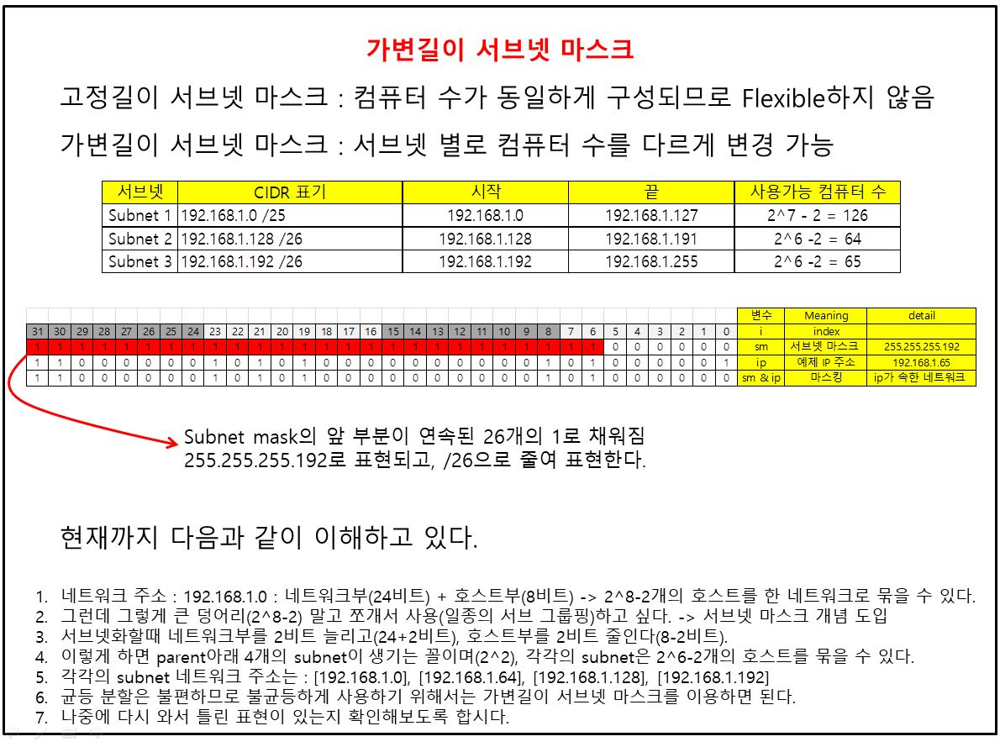

## TCP/IP 통신구조

네크워크의 본질적 기능, 미시적 관점에서 필요한 내용

---
### 1. 가변길이 서브넷 마스크

* 서브넷 별로 서브넷 마스크의 길이를 다르게 할 수 있다.
* 가변길이 서브넷 마스크 : VLSM(Variable, Length Subnet Masking)
* subnet mask의 len을 자유롭게 바꿀 수 있다면, 서브넷 별로 접속할 컴퓨터의 수를 유연하게 결정할 수 있다. 

### 2. CIDR

* Classless Inter-Domain Routing
* 가변길이 서브넷 마스크를 기반으로 하는 기술, 근데 약간 다르다.
* 네트워크 마스크가 짧다고 간주함으로써 여러 개의 네트워크에 대한 전송 규칙을 통합하는 기술이다!

